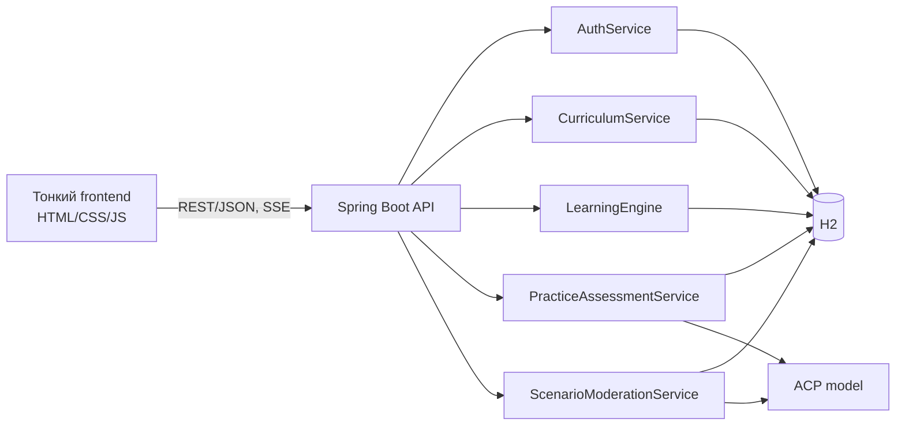
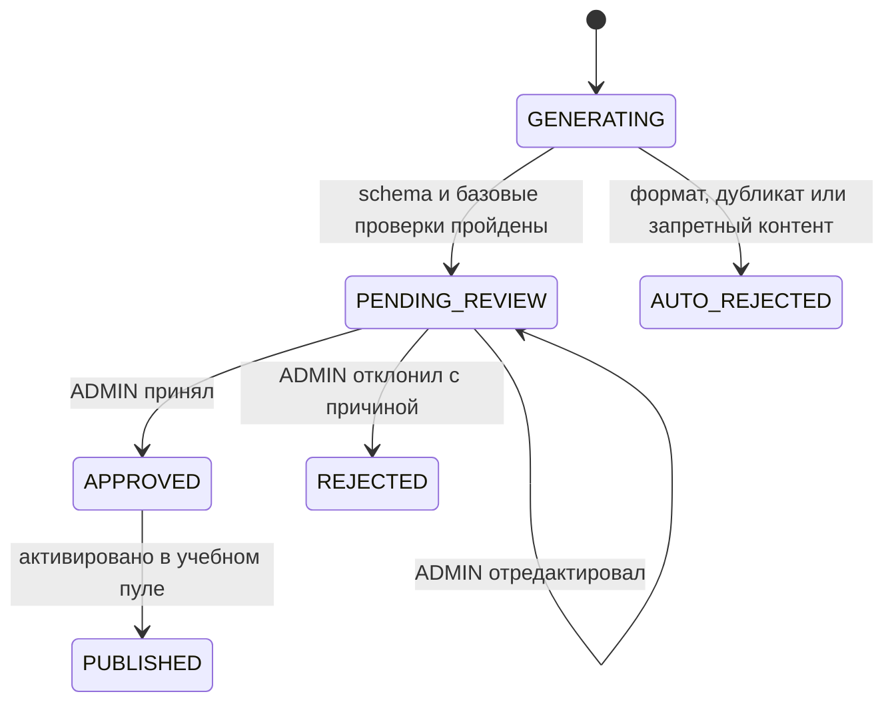

# Backend-first платформа «Вопросы-взломщики»

Дата: 2026-08-12
Статус: проектное решение утверждено в диалоге; ожидает финального просмотра перед планом реализации.

## 1. Цель

Превратить текущий автономный тренажёр с лёгким backend-коучем в серверную обучающую платформу, где:

- вся учебная логика, состояние, проверка и адаптация находятся на backend;
- frontend отвечает только за отображение, ввод, навигацию, доступность и вызовы API;
- пользователь учится различать семь техник, формулировать сильные вопросы и проводить полную цепочку мышления от вопроса до решения;
- AI-оценка не может самовольно поставить зачёт: backend валидирует её структурированный ответ и сам вычисляет итоговый вердикт;
- автоматически сгенерированные ситуации публикуются только после ручной модерации администратором.

## 2. Объём доработок

В проект входят ранее выбранные улучшения:

1. Три уровня сложности и пограничные отрицательные примеры.
2. Обязательное объяснение выбора категории в тренажёре.
3. Обратная связь, сравнивающая выбранную и правильную категории.
4. Адаптивное повторение, mastery по категориям и матрица путаницы.
5. Уточнение таксономии без увеличения числа категорий.
6. Осторожные формулировки доказательности в краткой теории.
7. Явные уровни доказательности источников.
8. Новая серверная рубрика управляемой практики.
9. Fallback, который никогда не выдаёт эвристическую проверку за экспертную.
10. Генерация ситуаций через очередь с ручной модерацией и отбраковкой плохих кейсов.
11. Доступный flip-card и полная клавиатурная навигация.
12. Локальные учётные записи, серверные сессии и роли `USER`/`ADMIN`.

## 3. Не входит в объём

- социальная авторизация;
- публичная регистрация администраторов;
- автоматическая публикация AI-сценариев;
- оценка того, является ли пользовательское решение объективно хорошим;
- семантическое оценивание краткого объяснения выбора категории в карточном тренажёре;
- сохранение полноценного офлайн-режима после перехода на серверное состояние.

## 4. Архитектурный принцип

Frontend не хранит правила начисления mastery, правильные ответы, prompt-шаблоны, пороги зачёта, роли или очередь модерации. Он отображает только server view model и отправляет намерения пользователя.

## 5. Таксономия

Сохраняются семь категорий:

| Код | Название | Основная операция |
| --- | --- | --- |
| `INVERSION` | Инверсия | Вывернуть цель, найти способы провала и обратить их в профилактику |
| `HYPERBOLE` | Гипербола | Довести значимый параметр до экстремума и извлечь переносимый механизм |
| `CROSS_DISCIPLINE` | Кросс-дисциплина | Перенести принцип из далёкой области, а не поверхностную метафору |
| `BACKCASTING` | Backcasting | Задать желаемое будущее и построить обратный маршрут к настоящему |
| `PROVOCATION` | Провокация | Поставить под сомнение правило или «священную корову», сохраняя психобезопасность |
| `REFRAMING` | Рефрейминг | Переформулировать симптом в корневую задачу или желаемый результат |
| `SIMPLIFICATION` | Упрощение | Найти ядро ценности и убрать лишнее, не теряя first principles |

Миграционное отображение: старое значение `Футуризм` читается как `BACKCASTING`. В теории для `SIMPLIFICATION` явно разделяются два близких движения: вычитание лишнего и восстановление решения из первых принципов.

## 6. Авторизация и владение данными

- Регистрация: username или email + пароль.
- Пароль хранится только как адаптивный salted hash.
- Аутентификация: серверная cookie-сессия с `HttpOnly`, `SameSite=Lax`; `Secure` в production.
- Смена идентификатора сессии после входа защищает от session fixation.
- Все попытки, mastery, чат и практика принадлежат конкретному пользователю.
- `USER` проходит обучение.
- `ADMIN` дополнительно видит очередь сценариев, принимает, редактирует или отклоняет кандидатов.
- Первый администратор создаётся из переменных окружения при пустой базе. Повторный запуск не меняет его пароль и не создаёт дубликат.
- Все изменяющие запросы защищаются от CSRF либо токеном, либо строгой same-origin политикой и проверкой Origin; конкретный способ фиксируется в плане реализации.

## 7. Серверный учебный контент

Backend является единственным источником:

- краткой и полной теории;
- формул, примеров и типичных ошибок;
- источников и уровня доказательности;
- карточек, вариантов, правильного ответа, сложности и объяснений;
- таблицы контрастов между категориями;
- category-specific критериев сильного вопроса.

### Уровни доказательности

Каждое теоретическое утверждение получает один из статусов:

- `RESEARCH_SUPPORTED` — прямо поддерживается указанным исследованием или обзором;
- `PRACTITIONER_METHOD` — признанная практическая методика, но не строгий научный вывод;
- `HEURISTIC` — авторская или учебная эвристика.

Краткая теория не использует причинные или универсальные утверждения, если источник этого не подтверждает. Frontend показывает статус и ссылку, полученные от backend.

## 8. Адаптивный карточный тренажёр

### 8.1 Контент

- Текущие 56 карточек становятся уровнем `L1`.
- Добавляются 21 карточка `L2` и 21 карточка `L3`.
- Итого: 98 карточек, по 14 на категорию.

Уровни:

- `L1`: явный маркер категории;
- `L2`: маркер скрыт, но основная операция однозначна;
- `L3`: пограничный кейс или hard negative между двумя категориями.

### 8.2 Ответ пользователя

Попытка содержит:

- `cardId`;
- выбранную категорию;
- обязательное свободное объяснение выбора;
- идентификатор выданной сервером попытки.

Объяснение обязательно и сохраняется, но не влияет на mastery. Оно показывается рядом с эталонным объяснением, чтобы пользователь сам видел расхождение без ненадёжного keyword- или AI-скоринга.

### 8.3 Проверка

Backend сравнивает выбранную категорию с правильной и возвращает:

- правильность;
- правильную категорию;
- объяснение основной операции;
- сравнение именно выбранной и правильной категорий;
- следующий рекомендованный шаг;
- обновлённую server view model прогресса.

Frontend не получает правильный ответ до отправки попытки.

### 8.4 Адаптивный выбор

Базовое распределение следующей карточки:

- 50% — слабые категории пользователя;
- 30% — частые пары путаницы;
- 20% — интервальное повторение и разнообразие.

Алгоритм учитывает correctness, сложность, давность и историю, но не скорость ввода объяснения. Точные коэффициенты хранятся в backend-конфигурации и покрываются тестами.

### 8.5 Mastery и путаница

- Mastery хранится отдельно по каждой категории.
- Ошибка увеличивает счётчик `выбрана X вместо Y` в направленной confusion matrix.
- Успешные ответы более высокой сложности дают больший положительный вклад.
- Недавняя единичная ошибка не должна обнулять устойчивый прогресс.
- API отдаёт готовые проценты, уровни и рекомендации; frontend ничего не пересчитывает.

## 9. Управляемая практика: четыре шага

Пользователь получает ситуацию и целевую категорию, после чего отправляет четыре отдельных поля:

1. `question` — сформулированный вопрос-взломщик;
2. `answer` — ответ на этот вопрос и открывшийся новый взгляд;
3. `reasoning` — рассуждение, связывающее вопрос, ответ и выводы;
4. `solution` — действие, решение или небольшой эксперимент, следующий из рассуждения.

Система не оценивает объективную ценность идеи. Она оценивает мыслительную цепочку и силу вопроса.

### 9.1 Три независимые проверки

#### A. Полнота цепочки

Детерминированные проверки backend сначала отсеивают пустые, слишком короткие или дублирующие поля. Семантическая проверка затем подтверждает:

- все четыре шага содержательны;
- `answer` отвечает на `question`;
- `reasoning` объясняет переход от вопроса и ответа к выводу;
- `solution` следует из рассуждения, а не добавлена независимо.

Результат: `PASS`/`FAIL` и статус каждого шага.

#### B. Попадание в целевую категорию

Шкала `0..3`:

- `0` — механика другой категории или обычный вопрос;
- `1` — категория обозначена формально, но основная операция не выполнена;
- `2` — основная операция категории выполнена;
- `3` — операция выполнена ясно, последовательно и без смешения с соседней категорией.

При необходимости возвращается `confusedWith`.

#### C. Сила вопроса внутри категории

Шкала `0..4` суммирует четыре признака: конкретность, глубина взлома, неожиданность и продуктивность для дальнейшего рассуждения. Якоря зависят от категории:

- инверсия: конкретный нежелательный исход и причинный механизм, а не просто «что, если не делать»;
- гипербола: назван параметр и экстремум, из которого можно извлечь полезный механизм;
- кросс-дисциплина: переносится принцип из далёкой области, не декоративная аналогия;
- backcasting: задано конкретное будущее состояние и вопрос заставляет двигаться назад к настоящему;
- провокация: атакуется правило или предположение, а не человек; последствия можно исследовать;
- рефрейминг: вопрос меняет симптом на корневую потребность, outcome или метрику;
- упрощение: выделяется ядро ценности и осмысленное ограничение или удаление.

### 9.2 Итоговый вердикт

Backend вычисляет вердикт после валидации model result:

- `PASSED`: полнота пройдена, category fit `>= 2`, question strength `>= 3`, confidence не `LOW`;
- `NEEDS_REVISION`: ответ проверен, но хотя бы один порог не выполнен;
- `UNVERIFIED`: модель недоступна, вернула невалидную схему, недостаточные evidence или низкую уверенность.

Модель возвращает оценки и evidence, но не является источником финального вердикта. Переданный моделью `verdict`, если он вообще присутствует, игнорируется.

### 9.3 Обратная связь

Для каждой попытки backend возвращает:

- итог;
- evidence из пользовательского текста для каждой проверки;
- отсутствующий или оборванный шаг цепочки;
- объяснение попадания или непопадания в категорию;
- предполагаемую категорию путаницы;
- сильные стороны только там, где они реально обнаружены;
- одну приоритетную коррекцию в формате «что изменить → почему → пример»;
- перечень полей, которые нужно исправить в следующей попытке.

Повторная попытка наследует исходную ситуацию, категорию, прошлый ответ и feedback. Пользователь может изменить только отмеченные слабые части; история попыток сохраняется.

### 9.4 Строгий ответ модели

Модель должна вернуть JSON, соответствующий versioned schema. Backend проверяет:

- наличие всех обязательных полей;
- допустимые enum и диапазоны;
- status для каждого из четырёх шагов;
- непустые evidence и corrections;
- соответствие corrections проваленным проверкам;
- отсутствие `PASSED` при `LOW` confidence;
- ограничение длины пользовательских и модельных текстов.

Каждая запись сохраняет model id, prompt version, schema version, latency и исход `VERIFIED`/`UNVERIFIED`.

### 9.5 Fallback

Fallback может:

- проверить наличие, длину и базовую форму четырёх полей;
- сообщить о технической недоступности семантической оценки;
- предложить повторить проверку.

Fallback не может:

- присвоить category fit или question strength;
- поставить `PASSED`;
- выдавать эвристику по ключевым словам за экспертную оценку.

## 10. Очередь генерации и модерации ситуаций

Автоматические проверки до очереди:

- валидный JSON и известная категория;
- допустимая длина;
- наличие только одной основной техники;
- отсутствие ответа в hint;
- близкий дубликат существующей ситуации;
- токсичный, дискриминационный или небезопасный контент;
- соответствие заявленной сложности.

Даже прошедший проверки кандидат не публикуется автоматически. Администратор видит ситуацию, категорию, hint, варианты, правильный ответ, объяснение, сложность, источник генерации и причины автоматических предупреждений.

Действия администратора: `approve`, `edit`, `reject`. Для отказа обязательна причина из справочника и необязательный комментарий. Аудит хранит автора действия, время, старое и новое состояние.

## 11. Основная модель данных

Новые сущности:

- `app_user`, `user_role`, `user_session`;
- `category`, `theory_section`, `evidence_source`;
- `scenario`, `scenario_option`, `scenario_revision`;
- `trainer_attempt`, `trainer_answer`, `category_mastery`, `category_confusion`;
- `practice_assignment`, `practice_attempt`, `practice_assessment`;
- `scenario_candidate`, `moderation_action`;
- `prompt_version`.

Старые chat-таблицы привязываются к `app_user`. Миграции не должны терять существующие диалоги и сгенерированные ситуации; до появления владельцев такие записи могут принадлежать seeded admin либо системному владельцу — выбор будет закреплён в implementation plan после проверки текущих данных.

## 12. API-контуры

Предлагаемые группы endpoint:

- `/api/auth/*` — регистрация, вход, выход, текущий пользователь;
- `/api/curriculum/*` — категории, теория и evidence;
- `/api/trainer/next` — следующая server-selected карточка;
- `/api/trainer/attempts` — отправка выбора и объяснения;
- `/api/progress` — mastery, confusion, рекомендации;
- `/api/practice/assignments` — новая ситуация с target category;
- `/api/practice/attempts` — четыре поля и асинхронная/синхронная оценка;
- `/api/practice/attempts/{id}` — результат и история исправлений;
- `/api/admin/scenario-candidates/*` — очередь и действия модератора;
- существующие `/api/chat/*` — после привязки к текущему пользователю.

Ответы API представляют готовое состояние экрана. Клиент не воспроизводит доменные правила.

## 13. Доступность frontend

- Flip-card является кнопкой или управляемым интерактивным элементом, а не `div` с обработчиком click.
- Переворот доступен через `Enter` и `Space`.
- Состояние раскрытия выражено через `aria-expanded`; связь с обратной стороной — через `aria-controls`.
- После проверки feedback получает программный фокус или объявляется через подходящий live region.
- Цвет не является единственным носителем правильности.
- Поддерживается `prefers-reduced-motion`.
- На мобильном экране лицевая и обратная стороны не создают ловушек фокуса.
- Все формы имеют label, inline-ошибки и summary серверной ошибки.

## 14. Ошибки и деградация

- Ошибки валидации возвращаются как единый problem-details формат с field errors.
- Повторная отправка защищена idempotency key или attempt state.
- Timeout модели не создаёт частичный зачёт.
- Невалидный model JSON логируется без чувствительных данных и превращается в `UNVERIFIED`.
- Если backend недоступен, frontend показывает явный offline/error state; локальный прогресс не симулируется.
- Если сессия истекла, несохранённый текст формы остаётся в памяти вкладки до повторного входа.

## 15. Наблюдаемость и безопасность данных

Метрики:

- latency и error rate по API;
- доля `UNVERIFIED` и причины;
- распределение category fit и strength;
- пары путаницы;
- acceptance/rejection rate генератора;
- возраст очереди модерации;
- повторные попытки до зачёта.

В обычные логи не попадают пароли, cookie, полные пользовательские тексты и полные model prompts. Для аудита хранятся идентификаторы, версии и статусы. Полные учебные ответы доступны только владельцу и администраторам в явно определённых административных сценариях.

## 16. Проверки и критерии приёмки

### Backend

- Неавторизованный пользователь не получает чужие данные или учебные попытки.
- `USER` не может читать и изменять очередь модерации.
- Первый admin корректно seed-ится только один раз.
- Mastery и confusion полностью вычисляются backend.
- Карточка не раскрывает правильный ответ до попытки.
- Rationale обязателен, сохраняется и не меняет correctness/mastery.
- Practice verdict невозможно получить `PASSED`, если хотя бы один серверный порог не пройден.
- Любой fallback practice result имеет `UNVERIFIED`.
- Отклонённый кандидат никогда не попадает в опубликованный пул.
- Одновременная модерация одного кандидата обрабатывается optimistic locking или эквивалентом.

### Frontend

- После очистки `localStorage` учебный прогресс не пропадает, потому что приходит с backend.
- Ни один доменный score не вычисляется JavaScript-кодом.
- Все ключевые сценарии доступны с клавиатуры.
- UI корректно показывает `PASSED`, `NEEDS_REVISION`, `UNVERIFIED` и истёкшую сессию.

### Контент

- В пуле 98 проверенных карточек: по 14 на каждую категорию.
- Каждая L3-карточка имеет явно указанную пару путаницы и контрастное объяснение.
- Теория содержит evidence status и не завышает научную уверенность.
- Для каждой категории описаны якоря силы вопроса и минимум два примера: сильный и пограничный.

## 17. Основные риски

1. **Нестабильность AI-оценки.** Снижается строгой схемой, evidence, versioning, backend-порогами и golden dataset.
2. **Двойной учёт category fit в силе вопроса.** Рубрики разделены: fit измеряет тип операции, strength — качество её выполнения.
3. **Слишком тяжёлая форма практики.** Четыре поля показываются как последовательные шаги с сохранением черновика в памяти вкладки.
4. **Потеря офлайн-возможностей.** Это осознанное следствие server-first архитектуры; UI обязан честно показывать отсутствие backend.
5. **Плохие AI-сценарии.** Автофильтры сокращают шум, но публикацию разрешает только ADMIN.
6. **Миграция существующего контента.** Нужны versioned migrations, импорт текущих JS-данных и проверки количества/категорий.

## 18. Порядок реализации верхнего уровня

1. Фундамент: миграции, пользователи, роли, сессии, ownership.
2. Перенос curriculum и карточек на backend.
3. Серверный trainer engine, rationale, mastery и confusion.
4. Новая practice assignment/attempt/assessment модель и строгий prompt contract.
5. Очередь генерации и admin moderation.
6. Упрощение frontend до server view models и исправление доступности.
7. Импорт дополнительных L2/L3 карточек, evidence grading и контентная проверка.
8. Сквозные тесты, документация и эксплуатационные метрики.

Детальный пофайловый план создаётся только после утверждения этой спецификации.
